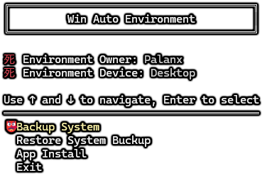

# Windows Automatic Environment

This is `PowerShell Script` application to facilitate the creation of backups, recovering and installing applications
automatically.

This initiative was born out of how much I hate doing backups before formatting my computer, formatting, recovering
those backups,
installing all the necessary programs, configuring drive letters, environment variables, etc... Just mentioning the list
already
makes me sleepy, so I have created an application without dependencies (it requires some `.exe`, but they are not
language dependencies
hehehhe) to make the tedious process of formatting my computer as less horrible as possible.

---

## Functionalities

For now there are just 3 main functionalities:

- Create Backups.
- Restore Backups.
- Install and Config Apps.

Each one of them has a `json` config file to define all the processes that will be executed to reach that goal, you can
see the [Wiki](https://github.com/Palanx/win-auto-env/wiki)
for more information.

## How to use this Repo

Ideally, create a `fork` of this repo and add, modify and delete any config and script that you need to mount your whole
environment.
I am 100% sure that no one of us have the same environment, so take your time and make this app your own app. If you
want to turn
fire on it or do whatever you want, you're free to do it, I don't care 🙈.

## How to Run

Double-click the `WinAutoEnv.ps1` file and follow the instructions described in the CLI.

The ideal use is:
1. Create the Backups.
2. Format your PC.
3. Recover the Drive Letters.
4. Recover the Backups.
5. Install and Config the Apps.

In that specific order.

---

## I love you

It may be just a coffee, but more than the beverage itself, it is the gesture that someone has really benefited from
what I have done
and is thankful for it. I love you anonymous dood.

---

## Backups and Restore Included

- **Chrome Profile:** Includes all Chrome Profile in the current user.
- **Drive Letters:** Includes all Drive Letters assigned mapped to the respective Disc.
- **Env Variables:** Includes the Env Variables that you specify in the `json` config file.
- **File Explorer Favorites:** Includes the Automatic/Custom destinations and the QuickAccess of the File Explorer.
- **Important Files:** Includes the paths and files that you specify in the `json` config file.
- **Powershell Profile:** Includes the Powershell Profile and Modules.
- **SSH Keys:** Includes all the SSH Keys in the `.ssh/` location of the current user.

---

## Apps Installers and Config Included

### Dev Apps

| App                | installer  | location                     | version    | notes                                                                                                                                                                                                                                                                                                                                                                                                                                                                                                                                      |
|--------------------|------------|------------------------------|------------|--------------------------------------------------------------------------------------------------------------------------------------------------------------------------------------------------------------------------------------------------------------------------------------------------------------------------------------------------------------------------------------------------------------------------------------------------------------------------------------------------------------------------------------------|
| JetBrains.Toolbox  | winget     | default                      | latest     | The custom path to install apps using this tool is automatically modified to `D:\Program Files\JetBrains\Toolbox` after install.                                                                                                                                                                                                                                                                                                                                                                                                           |
| Unity Hub          | standalone | `D:\Program Files\Unity Hub` | latest     |                                                                                                                                                                                                                                                                                                                                                                                                                                                                                                                                            |
| Windows SDK        | winget     | default                      | 10.0.26100 |                                                                                                                                                                                                                                                                                                                                                                                                                                                                                                                                            |
| Windows WDK        | winget     | default                      | 10.0.26100 |                                                                                                                                                                                                                                                                                                                                                                                                                                                                                                                                            |
| Visual Studio Code | winget     | default                      | latest     |                                                                                                                                                                                                                                                                                                                                                                                                                                                                                                                                            |
| Windows Terminal   | winget     | default                      | latest     |                                                                                                                                                                                                                                                                                                                                                                                                                                                                                                                                            |
| PowerShell         | winget     | default                      | latest     |                                                                                                                                                                                                                                                                                                                                                                                                                                                                                                                                            |
| Node               | winget     | default                      | latest LTS |                                                                                                                                                                                                                                                                                                                                                                                                                                                                                                                                            |
| Go                 | winget     | default                      | 1.18.10    |                                                                                                                                                                                                                                                                                                                                                                                                                                                                                                                                            |
| Git                | winget     | default                      | latest     | - **Editor Option**: VisualStudioCode  - **Custom Editor Path**:  - **Default Branch Option**:    - **Path Option**: Cmd  - **SSH Option**: OpenSSH  - **Tortoise Option**: false  - **CURL Option**: OpenSSL  - **CRLF Option**: Input  - **CRLFCommitAsIs Bash Terminal Option**: MinTTY  - **Git Pull Behavior Option**: Merge  - **Use Credential Manager**: Enabled  - **Performance Tweaks FSCache**: Enabled  - **Enable Symlinks**: Disabled  - **Enable FSMonitor**: Disabled |
| Git LFS            | winget     | default                      | latest     |                                                                                                                                                                                                                                                                                                                                                                                                                                                                                                                                            |
| Fork               | winget     | default                      | latest     |                                                                                                                                                                                                                                                                                                                                                                                                                                                                                                                                            |
| Postman            | winget     | default                      | latest     |                                                                                                                                                                                                                                                                                                                                                                                                                                                                                                                                            |
|                    |            |                              |            |

#### OS Apps

| App                | command    | location | version | notes                                                                                                                                                 |
|--------------------|------------|----------|---------|-------------------------------------------------------------------------------------------------------------------------------------------------------|
| Karspersky Premium | Manual     | default  | latest  | The .exe is compiled for each account, so the cretential are included and the installer can't be automated or shared.                                 |
| Lightshot          | winget     | default  | latest  | OS config modified to allow the app use.                                                                                                              |
| Nvidia App         | standalone | default  | latest  |                                                                                                                                                       |
| Logitech G HUB     | winget     | default  | latest  |                                                                                                                                                       |
| 7-zip              | winget     | default  | latest  | Download the `SetUserFTA` app to assing the file extensions `.7z`, `.zip`, `.rar`, `.tar`, `.gz`, `.bz2`, `.xz`, `.cab`, `.lzh`, `.arj`, `.z`, `.001` |
| DirectX            | winget     | default  | latest  |                                                                                                                                                       |
| MPV                | winget     | default  | latest  |                                                                                                                                                       |
| Powertoys          | winget     | default  | latest  |                                                                                                                                                       |
| AutoHotKeys        | winget     | default  | latest  |                                                                                                                                                       |

#### Personal Apps

| App             | command                 | location                            | version | notes                                                                                                           |
|-----------------|-------------------------|-------------------------------------|---------|-----------------------------------------------------------------------------------------------------------------|
| Chrome          | winget                  | default                             | latest  |                                                                                                                 |
| Microsoft To Do | Windows Store by winget | default                             | latest  |                                                                                                                 |
| Obsidian        | winget                  | default                             | latest  |                                                                                                                 |
| iCloud          | winget                  | default                             | latest  | Config what files will be sync must by made by hand.                                                            |
| Telegram        | winget                  | default                             | latest  |                                                                                                                 |
| WhatsApp        | winget                  | default                             | latest  |                                                                                                                 |
| Spotify         | winget                  | default                             | latest  |                                                                                                                 |
| Steam           | winget                  | `G:\Program Files\Steam`            | latest  |                                                                                                                 |
| GoG             | winget                  | `G:\Program Files (x86)\GOG Galaxy` | latest  |                                                                                                                 |
| Epic            | winget                  | `G:\Program Files (x86)\Epic Games` | latest  |                                                                                                                 |
| Discord         | winget                  | default                             | latest  |                                                                                                                 |
| qBittorrent     | winget                  | default                             | latest  |                                                                                                                 |
| VegasPro 21     | Manual                  | default                             | latest  | The .exe can't be downloaded by an automated tool. [link](https://dl03.magix.com/vegasproedit21_dlm_47zge9.exe) |

---

## License

This project is licensed under the MIT License – see the [LICENSE](LICENSE) file for details. Again, do whatever you
want hahaha.
